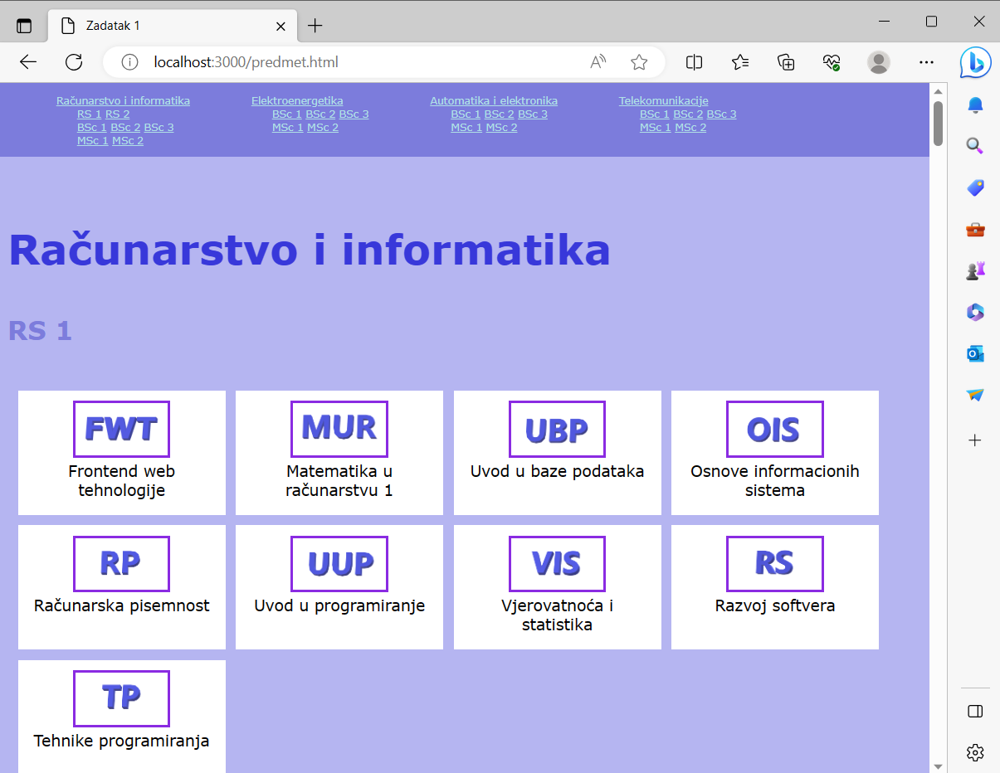
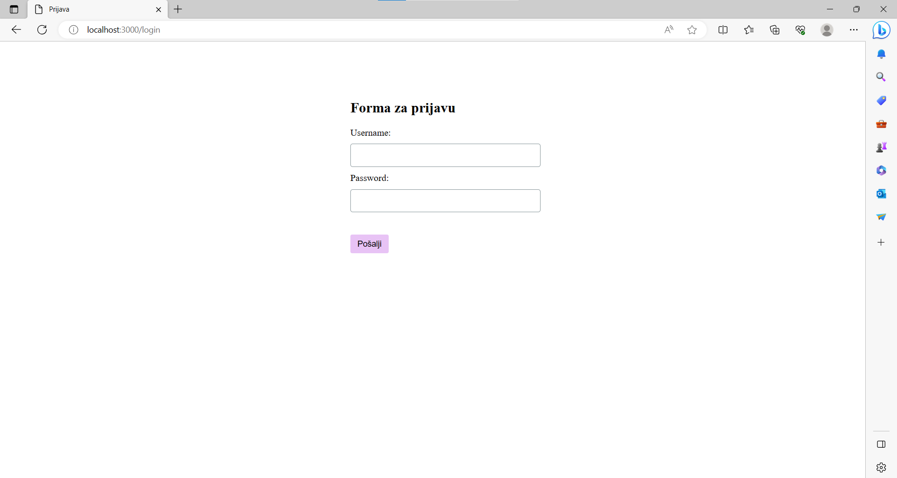
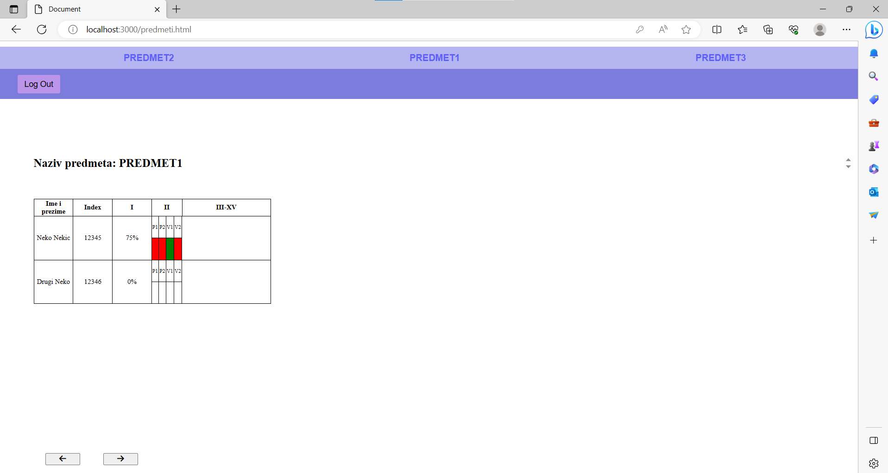
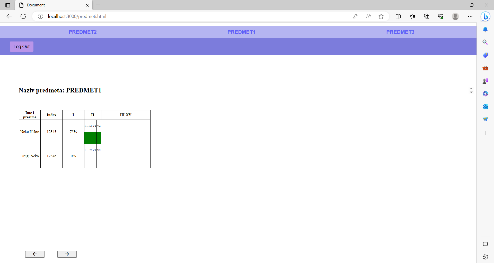
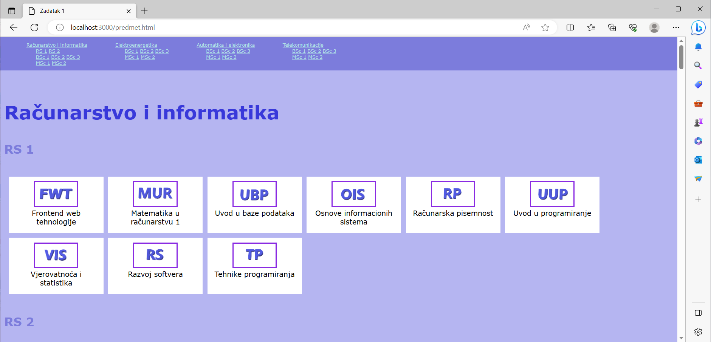
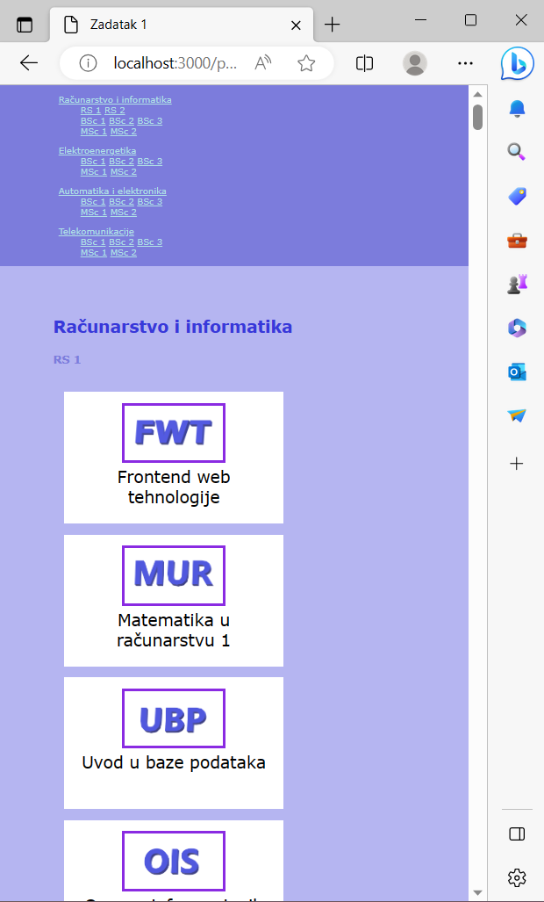

# Project Description

This project was done as part of the _Web Technologies_ course and is the first web application I've created.

## Technologies

- HTML
- CSS
- Node.js (with Express.js)
- MySQL

## Functionality

### The list of all courses

- It's a feature that shows all the courses available on the website, sorted by the subjects or majors they belong to. So, if you're looking for courses in a specific subject area, you can find them all listed in one place.

### Login form for registered professors

- The application does not offer a registration option; instead, it assumes that there are registered professors who have the ability to log in. For logging in, the following data is used: (username) and (password).

### Attendance table

- Every professor can see the student attendance table for all of his subjects. This table is such that if a student was present, the field is colored in green, and if the student was absent, the field is colored in red.

### Attendance modification

- Professors can also change student attendance by clicking on the appropriate table cell.

### Responsiveness

- The website is responsive.

